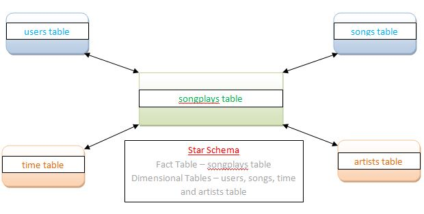

### Introduction
***
A music streaming startup, Sparkify, has grown their user base and song database and want to move their processes and data onto the cloud. Their data resides in S3, in a directory of JSON logs on user activity on the app, as well as a directory with JSON metadata on the songs in their app. 
We are required to –
* Build ETL pipeline that extracts their data from S3
* Stages them in Redshift
* Transforms data into a set of dimensional tables for analytics

### Project Description
*** 
We will need to load data from S3 to staging tables on Redshift and execute SQL statements that create the analytics tables from these staging tables.

**Song Dataset** – This dataset is a subset of real data from the Million Song Dataset. Each file is in JSON format and contains metadata about a song and the artist of that song. The files are partitioned by the first three letters of each song's track ID. This Dataset from S3 bucket will be loaded into staging table **staging_songs**

**Log Dataset** – This dataset consists of log files in JSON format generated by this event simulator based on the songs in the dataset above. These simulate activity logs from a music streaming app based on specified configurations. This Dataset from S3 bucket will be loaded into staging table **staging_events**

All the 4 domensional tables (users, songs, artists and time) extracted through above stated Staging Tables will be connected to one Fact Table called as songplays as mentioned below in the Star Schema.

#### Users table Columns –
user_id, first_name, last_name, gender, level

#### songs table columns –
song_id, title, artist_id, year, duration

#### artists table columns –
artist_id, name, location, latitude, longitude

#### time table columns –
start_time, hour, day, week, month, year, weekday

### Project Steps –
* Drop tables, Create tables, Copy staging tables and Insert dimensional tables queries were filled in **sql_queries.py**. 
* Redshift cluster and IAM role is created that has read access to S3.
* Add configuration details in dwh.cfg
* Through **JUPYTER TERMINAL** give the command **python create_tables.py**. Tables if exists will be dropped and then created.
* Through **JUPYTER TERMINAL** give the command **python etl.py**. Data is copied from S3 bucket into staging tables and with the help of Insert queries, dimensional tables will be inserted with data aswell.
* Ran few queries to test the number of records loaded into tables.
* Drop Redshift cluster and other resources loaded.
* Remove my credentials from the dwh.cfg

### Conclusion
All steps were executed and project rubric mentioned were achieved to produce the required analysis for this project.